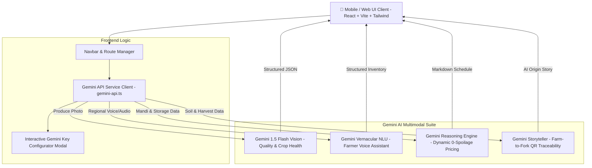

# 🌿 AgriFresh (0-Spoilage Platform) 🤖⚡
### *PS Open Innovation Hackathon • Powered by Google Gemini API*


> **AgriFresh** is a next-generation farm-to-table agricultural supply-chain platform built for the **PS Open Innovation Hackathon**. Powered by Google Gemini’s multimodal vision, audio vernacular NLU, and structured reasoning engines, AgriFresh eliminates post-harvest crop loss, protects farmer incomes, and delivers complete farm-to-fork transparency.

---

## 🚀 High-Impact Gemini API Features

AgriFresh implements 5 core multimodal Gemini capabilities tailored for agricultural logistics and food waste elimination:

### 1. 📸 Visual Quality & Ripeness Grading (Computer Vision)
* **How it works:** Farmers or quality checkers upload or snap a photo of harvested produce (e.g., tomatoes, apples, mangoes, leafy greens).
* **Gemini Integration:** Uses `gemini-1.5-flash` multimodal vision input with structured JSON output to:
  * Estimate ripeness percentage (0–100%).
  * Detect surface scarring, blemishes, or fungal spots.
  * Categorize produce commercial grade (**Grade A Export** / **Grade B Market** / **Grade C Processing**).
  * Estimate shelf-life in days and specify precise cold storage temperature/humidity rules.

### 2. 🎙️ Multilingual Vernacular Voice Assistant for Farmers
* **How it works:** Regional farmers can skip complicated app forms and list harvests using natural voice speech in regional Indian languages (**Hindi**, **Marathi**, **Telugu**, **Tamil**, **Kannada**, **English**).
* **Gemini Integration:** Processes natural speech input to extract structured inventory metadata:
  * Produce name & quantity (kg / quintals).
  * Harvest date & expected rate (₹/kg).
  * Farm location & nearest cold storage hub assignment.
  * Generates an encouraging audio/text confirmation in the farmer's spoken dialect.

### 3. 📈 Dynamic Freshness-Based Pricing & Inventory Markdown Engine
* **How it works:** Multi-parameter AI pricing model that balances Mandi wholesale price benchmarks, time since harvest, storage conditions, and regional demand.
* **Gemini Integration:** 
  * Recommends a **Fair Farm-Gate Payout Rate** for growers (+15% to 20% above traditional middleman rates).
  * Auto-schedules a 4-day progressive consumer discount markdown (Day 0: 0%, Day 1: 15%, Day 2: 35%, Day 3: 60% Flash Sale) to clear inventory before spoilage occurs (Zero Spoilage!).

### 4. 📜 Farm-to-Fork Traceability & Harvest Storyteller
* **How it works:** Consumers scan an on-package QR code or enter a Batch ID.
* **Gemini Integration:** Gemini ingests soil health indices (pH, NPK), harvest timestamps, and pesticide-free certifications to generate:
  * An interactive farm origin story written by AI.
  * Nutritional density card & Superfood scorecard.
  * AI Chef recipe pairings.
  * Kitchen storage tips to maximize household shelf life.

### 5. 🔬 Pest & Crop Health Early-Warning Diagnostic Scanner
* **How it works:** Contract growers snap pictures of diseased leaves, stem spots, or soil patches.
* **Gemini Integration:** Gemini identifies probable pathogens (e.g., *Alternaria solani* Early Blight, Nitrogen chlorosis), provides confidence %, severity level (Low to Critical), and prescribes organic bio-remediation protocols (Neem oil, *Trichoderma viride*, Panchagavya).

---

## 🏗️ System Architecture



---

## 🛠️ Tech Stack

* **Frontend:** React 19, TypeScript, Vite, Tailwind CSS, Shadcn UI components, Framer Motion, Lucide Icons.
* **AI & Vision:** Google Gemini API (`gemini-1.5-flash`, `gemini-2.0-flash`) with structured JSON schema responses & client-side fallback simulation.
* **State & Data:** TanStack React Query, Wouter Routing, LocalStorage Key Persistence.

---

## ⚡ Quick Start & Local Setup

### 1. Clone the Repository
```bash
git clone https://github.com/priyanshu-sarjan/BUILD-WITH-VEXITE-0-Spoilage-.git
cd BUILD-WITH-VEXITE-0-Spoilage-
```

### 2. Install Dependencies
```bash
npm install
```

### 3. Set Up Environment Variables (Optional)
Create a `.env.local` file in `artifacts/ayutrace/` or root:
```env
VITE_GEMINI_API_KEY=your_gemini_api_key_here
```
> 💡 *Note: If no API key is set, AgriFresh automatically provides rich, realistic simulated Gemini responses so you can test all features out-of-the-box! You can also enter a key directly in the UI via the "Set Gemini API Key" button in the Navbar.*

### 4. Run Development Server
```bash
npm run dev
```
Open [http://localhost:5173](http://localhost:5173) in your browser.

---

## 🏆 PS Open Innovation Submission Details

* **Hackathon Event:** Build With Vexite
* **Track:** PS Open Innovation
* **Theme:** 0-Spoilage Agricultural Supply Chain
* **Repository URL:** [https://github.com/priyanshu-sarjan/BUILD-WITH-VEXITE-0-Spoilage-.git](https://github.com/priyanshu-sarjan/BUILD-WITH-VEXITE-0-Spoilage-.git)
* **Live Web App:** [https://ai-agent-ps.vercel.app/](https://ai-agent-ps.vercel.app/)

---

*Made with ❤️ & 🤖⚡ for Indian Farmers & Sustainable Food Logistics.*
